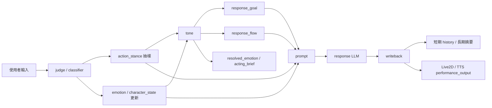
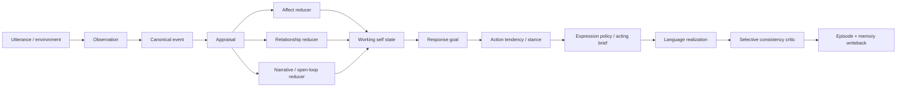

# 更擬人化的情緒轉換與角色扮演架構深入分析

日期：2026-07-11  
範圍：`langgraph_test` 現行 `judge → emotion → tone → respond → writeback` 對話管線  
交付邊界：本文件只分析、提出實驗與分期方案，不修改執行程式

---

## 1. 結論先行

目前架構已經明顯超過一般「角色卡 + system prompt」：它把本輪義務、人格反應、句子節奏、情緒累積、短長期記憶與 Live2D/TTS 表演輸出拆成不同元件。這個方向是對的，而且是後續深化最有價值的基礎。

真正限制擬人感的主因，不是角色設定不夠多，而是下列狀態還沒有形成可解釋的閉環：

1. **單一 `emotion` 同時被當成激動、冷暖、親近與傲嬌強度。** 負評會把它推高，稱讚與調情也會把它推高，但高值最後又常被翻譯成「炸毛」。不同情緒原因因此可能得到相同表演。
2. **事件有分類，卻沒有「這件事對角色意味著什麼」的完整 appraisal。** 現在有 `event_type`、`risk`、`relationship_signal`，但缺目標是否受阻、可控性、確定性、面子威脅、信任變化與未解衝突等因果欄位。
3. **角色有瞬時狀態，沒有真正的情緒 episode。** 沒有保存「因為哪一件事、對誰、何時開始、是否已修復、應以多快速度消退」，所以情緒像數字漂移，不像角色正在經歷某件事。
4. **關係訊號只影響本輪抽樣，沒有累積成關係模型。** `closer` / `distant` 目前不是可追蹤的信任、熟悉、親密、警戒或未解張力。
5. **已算出的內外表演資訊沒有完全投影到台詞生成。** `acting_brief` 會建立 `inner / outer / tone / strategy / avoid`，但目前沒有被編譯進既有的 `tone_hints` / Action Stance 文字層；它只間接影響回應長度。先前把完整 brief 留在 performance / Live2D / TTS 端、避免形成第三套 prompt 規則的邊界是合理的，真正缺的是一個受控的 expression projection。
6. **記憶能保存內容，但尚未成為「角色如何理解自己與對方」的可查詢模型。** 使用者事實、AI 人設、共同任務與情緒轉折雖有 Markdown 分區，仍缺來源、信心、時效、關係對象與矛盾處理。

因此，最值得採取的主線不是擴寫更多角色卡，也不是一次建立完整心理學模擬器，而是：

> 先把現有元件接成「事件 → 主觀評估 → 情緒 episode / mood / 關係轉移 → 回應義務 → 行動傾向 → 內外表演 → 台詞 → 記憶 / 修復」的因果鏈。

我建議採 **方案 A 再方案 B**：先完成既有架構閉環，再加入分層情緒與關係狀態；暫時不要直接跳到會自主規劃生活與長期目標的完整角色 agent。

---

## 2. 本次核對方式與限制

### 2.1 核對內容

- 靜態追查：`state.py`、`graph.py`、`judge.py`、`emotion.py`、`defect.py`、`tone*.py`、`prompting.py`、`response.py`、`writeback.py`、`memory_quality.py`。
- 輕量 replay：執行 `scripts/replay_pipeline.py`，固定 seed，不呼叫 response LLM。
- 外部架構參考：情緒 appraisal、分層 affect、persona consistency、memory / reflection 等一手論文。

### 2.2 限制

- Replay 使用 mock / 規則降級路徑，適合驗證 deterministic routing，不代表正式 judge LLM 的逐字輸出。
- 本報告沒有執行 `--with-response`，所以不把台詞品質問題誤判成 router 問題。
- 本報告討論的是「可信的角色連續性」，不是宣稱系統真的具有人的主觀感受。

---

## 3. 現行架構：已經比角色卡多了什麼



現有設計中最值得保留的責任分層如下：

| 層次 | 現行 owner | 實際責任 | 評價 |
|---|---|---|---|
| 事件理解 | `judge.py`、`judging.py` | 分類、事件類型、強度、風險、關係訊號、狀態微調建議 | 已有良好雛形，但 schema 驗證偏弱 |
| 本輪義務 | `tone_goal.py` | 回答、承接情緒、修正誤會、告別、界線、接話 | 很重要，應繼續維持最高優先權 |
| 人格反應 | `defect.py` | 依事件、舊情緒、歷史抽出 `action_stance` | 已超過固定角色卡，但仍偏「表演模式輪盤」 |
| 情緒狀態 | `emotion.py` | 更新單一情緒值與 13 維 `character_state` | 有狀態性，但兩套 affect 模型尚未統一 |
| 台詞節奏 | `tone_flow.py` | 選擇 `deny_then_soften` 等句子結構 | 是目前最成熟、最可觀測的角色化元件之一 |
| 表演解析 | `tone_performance.py` | 把狀態轉成 `resolved_emotion` 與 `acting_brief` | 概念好，但 `acting_brief` 尚未接進生成 |
| 語言實現 | `prompting.py`、`response.py` | 組裝人格、目標、姿態、節奏、記憶，生成台詞 | 分層清楚；目前 prompt 中隨機語彙素材較多 |
| 連續性 | `writeback.py` | 回寫歷史、長期摘要、狀態摘要、表演輸出 | 能累積，但未保存情緒事件因果與關係生命週期 |

相較市面常見角色卡，這套架構已多出三個重要能力：

- **人格不是只有描述，而會選擇本輪反應姿態。**
- **角色台詞不只靠模型自由發揮，而有 `response_goal` 與 `response_flow` 約束。**
- **角色具有跨輪狀態與回寫機制。**

這三點應視為後續優化的核心資產，不應退回「寫更長的 persona prompt」。

---

## 4. 現況深入問題

### 4.1 `emotion` 的真實語義比較像 activation，不是完整情緒

`emotion.py` 的 `DELTA_MAP` 會讓：

- `negative_feedback`、`sensitive_topic`、`questioning` 往正值上升；
- `praise`、`flirt` 又透過 affection bonus 往正值上升；
- `normal` 與 `farewell` 往下降或冷卻。

但 `vocab.py` 會把正值區依序解釋為「軟嬌動搖」與「炸毛激動」。因此同一高值可能由被辱罵、被稱讚、被調情或連續執行任務造成。這些事件的 **valence、arousal、social meaning、action tendency** 並不相同，卻共享同一條冷暖軸。

同時，`character_state` 已另有 `mood`、`tension`、`intimacy`、`embarrassment`、`annoyance`、`hostility` 等維度。也就是目前存在兩套部分重疊的模型：

- 舊的單一 `emotion`：主導詞彙區、flow matrix、tone tweak；
- 新的 `character_state`：主導 `resolved_emotion`、回應長度與表演輸出。

這會造成「內部向量判斷是害羞，舊 scalar 卻判斷成炸毛」的雙重真相。

**建議：** 暫時保留 `emotion` contract，但明確把它降格為 `activation_projection` 或相容欄位；真正情緒決策改由 `affect_state` 的 valence / arousal / threat / intimacy 等資訊導出。

### 4.2 控制順序讓表演姿態反過來改寫內在情緒

目前 `judge_input()` 內先執行 `decide_defect_strategy()`，它使用的是上一輪 `emotion`；之後 graph 才執行 `update_emotion()`。而 `update_emotion()` 又依剛抽出的 stance 額外增減情緒，例如 `defensive_counter`、`chaotic_rant`、`emotion_burst` 會把情緒推高。

因此目前因果鏈部分是：

> 先抽到「我要怎麼演」 → 再因為這個演法而改變「我內心怎麼感受」。

角色表演確實可能反過來影響心情，但若每輪都以此為主要順序，容易讓隨機 stance 變成情緒真相。更穩定的次序應是：

> 事件 appraisal → 內在狀態轉移 → action tendency / stance → expression regulation。

表演對內在的回饋可以保留，但應放到回合後的次要 feedback，而不是本輪主要 state transition。

**2026-07-12 修正：** 已將 `decide_defect_strategy()` 從 `judge_input()` 拆出為獨立 `stance` 節點，控制順序調整為 `judge → emotion / emotion_tick → stance → tone`。目前內在狀態先依事件 appraisal 完成 transition，stance 再讀取更新後的 `emotion`；`update_emotion()` 不讀 `action_stance`，因此本輪隨機表演姿態不再成為主要情緒轉移來源。`scripts/replay_pipeline.py` 亦同步採用相同順序，並由 graph topology regression 鎖定此 contract。回合後 expression feedback 尚未新增，避免在沒有明確 reducer contract 前重新引入反向污染。

### 4.3 `acting_brief` 是目前最可惜的未投影能力

`tone_performance.py` 已清楚區分：

- `inner`：角色內心；
- `outer`：外顯防衛或坦率程度；
- `tone`：說話感覺；
- `strategy`：如何回應；
- `allowed_patterns` / `avoid`：允許與避免的演法。

這正是「不像角色卡」的關鍵：同一角色可以內心高興、外表嘴硬，而不是人格與情緒只剩一組形容詞。

但文字生成層沒有使用 `acting_brief` 的解析結果。這不表示應把完整 dict 直接加入 `prompting.py`：先前將它留在 performance / Live2D / TTS 端，是為了避免它和 Action Stance、Response Flow 形成第三套互相競爭的規則。現況真正缺少的是：把 brief 中少量、無衝突的 expression 結論，編譯進既有 `tone_hints` 或 Action Stance 描述。

**建議：** 第一個低風險實驗是建立 `acting_brief → expression_projection`，只留下 `display / intensity / avoid` 等語言真正需要的訊號，再合併到現有語氣層；`inner` 繼續供 trace / performance 使用，不另開一個平行 prompt section。

### 4.4 沒有情緒 episode，只有每輪數值變化

目前沒有保存以下資訊：

- 觸發事件 ID 與原始原因；
- 情緒指向誰或什麼；
- 起始回合、峰值與預期半衰期；
- 是否被新事件打斷、混合或重新評估；
- 是否有未解衝突；
- 哪個修復事件讓 episode 結束。

所以使用者先冒犯、再道歉、再補一句稱讚時，系統只能各輪重新抽樣，無法表現「還有點介意，但看得出對方在修補」。真人感往往不來自更強烈的情緒，而來自 **情緒具有原因、慣性、轉折與餘韻**。

### 4.5 關係沒有 hysteresis，容易瞬間親近或瞬間翻臉

`relationship_signal=closer/distant` 目前只調整該輪 stance 權重；`intimacy` 雖會累積，卻沒有：

- 對應特定使用者；
- trust、familiarity、safety、respect 等不同關係面向；
- 升降速率不對稱；
- 門檻與解鎖行為；
- 修復後仍保留的餘波；
- 可追溯的關係事件。

更自然的關係通常需要 hysteresis：熟悉與信任慢慢增加，嚴重背叛可快速下降，但一次稱讚不能立刻變成深度親密，一次誤會也不應永久翻臉。

### 4.6 短句跳過 emotion，連冷卻也一起被跳過

`graph.py::_should_skip_emotion()` 對 `category == normal` 且長度小於 5 的輸入直接前往 tone。這雖節省處理，但「嗯」、「喔」、「好啦」、「沒事」在關係修復或尷尬情境中可能非常重要；而且跳過 node 也代表 decay / baseline return 沒有執行。

**建議：** 未來可跳過昂貴的 LLM appraisal，但不應跳過便宜的 deterministic state tick。至少要讓 mood、episode intensity 與 unresolved tension 正常衰減。

### 4.7 Judge 的豐富 JSON 尚未被嚴格限制

`parse_judge_output_v2()` 目前主要驗證 `category` 與少量 boolean / target，對以下欄位較寬鬆：

- `event_type` 是否在 ontology；
- `intensity`、`risk` 是否真在 0..1；
- `relationship_signal` 是否為受控值；
- `state_delta_suggestion` 是否只含允許 key、每維是否 clamp；
- LLM 建議是否與 rule evidence 衝突。

雖然後續 `emotion.py` 只以 0.2 / 0.3 比例混入建議，但未知 key 仍會被加入 `character_state`。這會讓 state schema 隨模型輸出漂移。

**建議：** LLM 只提出 bounded appraisal proposal；validator canonicalize 後，deterministic reducer 才有權修改 state。

### 4.8 隨機性目前較像「換花樣」，不完全像「個體差異」

Flow、stance、vocab palette、tone tweak 都含隨機抽樣，且有 anti-repeat。這能避免每輪相同，但隨機來源分散，沒有共同 latent cause。結果可能是台詞不重複，角色心理卻無法說明為什麼這輪突然換了一種反應。

更擬人的做法不是消除隨機，而是讓隨機服從穩定條件：

- 同一 appraisal 下只能在合理 action tendencies 中抽；
- 個性決定長期偏好；
- mood 與關係狀態調整分布；
- 最近使用過的表演模式只作次要去重；
- seed 與 decision trace 可重播。

### 4.9 記憶保存了「說過什麼」，還沒有完整保存「這代表什麼」

現有長期摘要已區分使用者記憶、AI 人設/偏好、共同事實/任務狀態，也有 structured fallback，這比直接拼接歷史好很多。

但若要支撐長程角色演化，建議再區分：

| 記憶類型 | 內容 | 更新規則 |
|---|---|---|
| Identity memory | 不輕易改變的角色核心、價值、界線 | 只能由設定或高信心 review 更新 |
| Episodic memory | 某次互動發生什麼、誰做了什麼 | 保存事件、來源、時間與 salience |
| Relationship memory | 對特定使用者的信任、熟悉、共同梗、未解張力 | 由事件 reducer 漸進更新 |
| Self-narrative | 角色如何解釋自己的行為與關係 | 由多個 episode 反思得出，不直接等同事實 |
| World / task state | 已完成、拒絕、承諾、待處理事項 | 需明確 truth / status contract |

如果不分層，角色演出的「我才不在意」可能被摘要成穩定人格事實，覆蓋真正的內在狀態；一次受傷也可能被升格成永久關係結論。

---

## 5. Replay 證據：目前最明顯的是修復鏈缺口

### 5.1 連續場景觀察

使用固定 seed、decision replay only：

| 輸入摘要 | 決策結果 | 顯示的問題 |
|---|---|---|
| 「剛才那一波閃招還滿帥的」 | `normal → continue_banter → dismissive → hard_deflect` | fallback 關鍵字沒有把「帥」視為 praise，語意與關係訊號遺失 |
| 「你之前說最討厭青椒對吧」 | `negative_feedback → acknowledge_emotion → defensive_counter` | 「討厭」描述的是角色偏好，不是使用者在攻擊角色 |
| 含「早點畢業關台」的長段辱罵 | `farewell → close_conversation` | 「關台」表面詞可能壓過 hostile / boundary 語境 |

這些不是單純台詞問題，而是事件 appraisal 在降級路徑下仍以 keyword category 為主。

### 5.2 自訂關係修復場景

| 回合 | 使用者輸入 | category / goal / stance / flow |
|---:|---|---|
| 1 | 你今天看起來很可愛。 | `praise / acknowledge_emotion / tsundere_service / emotional_leak` |
| 2 | 我不是隨口說的，是真的覺得你可愛。 | `praise / acknowledge_emotion / tsundere_service / deny_then_soften` |
| 3 | 可是你剛剛突然冷淡，我有點難過。 | `normal / continue_banter / chaotic_rant / spiral_rant` |
| 4 | 沒關係，我知道你不是故意的。 | `normal / continue_banter / deadpan / dry_answer` |
| 5 | 那我明天再來找你，晚安。 | `farewell / close_conversation / tsundere_service / deny_then_soften` |

前兩輪可以展現傲嬌，但第三、四輪沒有建立：

1. 使用者表達受傷；
2. 本輪義務改成承認影響或修復；
3. 未解張力建立；
4. 使用者接受修復；
5. 張力下降但保留些微尷尬餘韻。

因此，「更擬人化」最先需要的不是更多情緒詞，而是 **relationship rupture / repair state machine**。

---

## 6. 建議目標架構



### 6.1 穩定核心：Character Kernel

只放不應被每輪對話任意改寫的內容：

- values：角色在意什麼；
- needs：面子、連結、自主、勝任感等需求；
- boundaries：不可跨越的界線；
- defense preferences：嘴硬、轉移、反咬的長期傾向；
- epistemic limits：不能為了角色感捏造事實；
- speech identity：節奏偏好，而不是固定口頭禪清單。

這一層才接近傳統角色卡，但它只是一個 kernel，不是完整角色。

### 6.2 中期狀態：Mood 與 Relationship

建議先控制在少量可解釋維度：

```yaml
mood:
  valence: -1.0..1.0
  arousal: 0.0..1.0
  agency: 0.0..1.0

relationship:
  familiarity: 0.0..1.0
  trust: 0.0..1.0
  closeness: 0.0..1.0
  safety: 0.0..1.0
  unresolved_tension: 0.0..1.0
```

不要一開始加入二三十維。每新增一維都必須能回答：哪種事件更新它、如何 decay、它會改變哪個決策、如何測試。

### 6.3 短期狀態：Emotion Episode

```yaml
active_episode:
  family: embarrassment | affection | irritation | hurt | concern | relief | curiosity
  target: user | self | task | third_party
  cause_event_id: string
  appraisal:
    goal_congruence: -1.0..1.0
    controllability: 0.0..1.0
    certainty: 0.0..1.0
    face_threat: 0.0..1.0
    norm_violation: 0.0..1.0
  intensity: 0.0..1.0
  started_turn: int
  half_life_turns: float
  unresolved: bool
  mixed_with: optional emotion family
```

關鍵不是精準模擬人腦，而是讓每次情緒轉換具備可追查原因與合理時間尺度。

### 6.4 表達調節：內心不等於台詞

把現有 `acting_brief` 視為內部 performance contract，再編譯出文字層可用的 expression projection：

```yaml
expression_projection:
  display: "先嘴硬，第二句才稍微接受"
  communicative_intent: "承接稱讚並維持親近"
  intensity: 0.55
  avoid:
    - "直接冷淡句點"
    - "把稱讚轉成攻擊"
```

`inner` 仍留在 `acting_brief` 與 decision trace，不直接成為另一組台詞規則。projection 只補強現有 tone / stance，這樣能產生「內心與外在有落差」的角色性，又不需要每次硬塞「才不是為了你」。

### 6.5 Narrative / Open Loops

角色要像活著，不只要記得事實，還要記得尚未結束的東西：

- 剛才答應之後再說的事；
- 尚未修復的冒犯；
- 共同梗是否已經用太多次；
- 最近一次脆弱表達後是否正在掩飾；
- 使用者明天要回來的承諾；
- 角色自己對某段互動形成的暫時看法。

這些 open loops 會讓角色下一輪有「帶著上一刻進來」的感覺，而不是每句都像獨立 prompt。

---

## 7. 三種可行方案

### 方案 A：補齊現有閉環（建議先做）

範圍：

- 統一 `emotion` 與 `character_state` 的責任；
- 嚴格驗證 `event_analysis`；
- 讓 `acting_brief` 的受控 projection 真正進入既有語氣層，不新增第三套 prompt 規則；
- 短句仍執行 deterministic decay；
- replay 顯示 appraisal、完整向量與 acting brief；
- 新增 rupture / repair、sarcasm、重複稱讚、短句冷卻場景。

優點：改動可小、容易驗證、直接利用現有資產。  
限制：仍沒有真正的長期關係生命週期。

### 方案 B：分層 affect + relationship episode（第二階段建議）

範圍：

- 新增 mood、active episode、relationship state；
- 建立 appraisal reducer 與 hysteresis；
- 新增 `repair_relationship`、`reassure_user`、`reappraise_event` 等 response goal；
- writeback 保存 episode 因果與未解張力。

優點：最能提升長程擬人感，讓相同輸入因關係與前情得到不同反應。  
限制：需要明確 schema、migration 與多輪 regression，不能只靠 prompt 實作。

### 方案 C：完整角色 agent（暫不建議直接跳）

範圍：

- 長期目標、日程、主動提問、反思、自我敘事、環境行動；
- 記憶依 relevance / recency / salience 檢索；
- 角色可依 open loops 主動延續話題。

優點：最接近「持續存在的角色」。  
限制：很容易擴張成另一個大型 agent 系統；若 A、B 尚未穩定，主動性只會放大人格漂移與記憶錯誤。

**推薦順序：A → B → 經評估後再決定 C。**

---

## 8. 最值得先做的五個實驗

### 實驗 1：把 `acting_brief` 編譯進既有語氣層

假設：目前角色向量沒有充分反映在台詞，主因是 brief 沒有形成受控文字 projection。  
最小改動：由 `tone.py` 產生 compact `expression_projection`，合併進既有 `tone_hints` / stance 說明；不新增獨立 expression prompt section。  
驗證：同一 `response_goal` 下，切換 `honest / teasing / boundary / tsundere` 時，台詞應呈現不同內外落差，但核心義務不變。  
風險：brief 與 stance / flow 衝突；需定義優先序為 `goal > safety/truth > expression > style`。

### 實驗 2：將 `emotion` 明確化為 activation projection

假設：雙 affect 系統的語義衝突是錯誤表演的重要來源。  
最小改動：先不刪欄位，把 scalar 改由 `character_state` 投影導出，並在 trace 中同時顯示 valence-like 與 arousal-like 狀態。  
驗證：高 embarrassment 與高 hostility 不再必然落到相同 hot zone。  
風險：會改變既有 flow 分布，需 seed-based baseline 對照。

### 實驗 3：加入 `active_episode` 與修復目標

假設：關係修復缺口主要來自缺少 episode / open loop，不只是 category 少一種。  
最小改動：先只支援 `hurt / embarrassment / affection / irritation / relief`，每種有 cause、intensity、half-life、unresolved。  
驗證：「冷淡 → 使用者受傷 → 角色承認 → 使用者接受 → 餘韻式告別」五輪應有連續轉移。  
風險：episode 若永不清除會造成角色記仇；必須有 repair 與 timeout。

### 實驗 4：建立最小 relationship state

假設：親近感應來自累積與共同歷史，不應只靠當輪 `closer`。  
最小改動：先做 `familiarity / trust / closeness / unresolved_tension` 四維，且每輪 delta 很小。  
驗證：同一句調情對初見使用者與熟悉使用者應有不同表達；一次稱讚不能跨越多個親密門檻。  
風險：使用者識別與隱私邊界必須先定義；無穩定 user key 時只保存在 conversation scope。

### 實驗 5：加入 selective persona consistency critic

假設：不是每輪都需第二次 LLM，但高風險台詞值得在輸出前檢查。  
觸發條件：新 persona fact、承諾、嚴重關係變化、邊界事件、與長期記憶矛盾。  
檢查內容：是否違反 identity、是否捏造經歷、是否跳過 response goal、是否錯誤升格關係。  
風險：延遲與成本；應 selective，而非所有台詞固定雙生成。

---

## 9. 分期實作路線

### Phase 0：觀測與 contract 鎖定

目標：先能看見問題，不改 public behavior。

1. 擴充 replay 欄位：`event_type`、`risk`、`relationship_signal`、完整 `character_state` diff、`resolved_emotion`、`acting_brief`。
2. 固定 seed，保存每輪 state transition reason。
3. 建立多輪測試場景：重複稱讚、挖苦、受傷修復、短句沉默、界線壓力、離開再回來、承諾追蹤。
4. 將正式 LLM judge 與 rule fallback 結果並列，不混為單一準確率。

完成門檻：任何異常台詞都能先定位為 appraisal、state、goal、stance、flow、prompt 或 generation 問題。

### Phase 1：現有閉環修復

可能 owner：

- `judge_validators.py`：canonical event schema；
- `emotion.py`：deterministic reducer 與 scalar compatibility projection；
- `tone.py` / `tone_performance.py`：統一 resolved affect，並把 expression brief 編譯成 compact projection；
- `prompting.py`：只沿既有語氣層接收 projection，不增加第三套平行規則；
- `graph.py`：短句仍執行 state tick。

完成門檻：`acting_brief` 經受控 projection 影響台詞；同源狀態不再互相矛盾；降級路徑仍可解釋。

### Phase 2：Episode 與 Relationship

可能新增的 additive state：

- `affect_state`；
- `active_episode`；
- `relationship_state`；
- `open_loops`。

保留舊 `emotion`、`character_state` 作相容 view，待 replay 與實際對話穩定後再討論移除。

完成門檻：至少能通過 rupture / repair、親近累積、嚴重冒犯、事件冷卻四類多輪 trajectory。

### Phase 3：記憶與反思分層

1. Identity 不被一般摘要直接改寫。
2. Episode 保存來源、時間、對象、salience、confidence。
3. Relationship 從事件導出，不把模型台詞當外部事實。
4. Reflection 只能從多個記憶推導暫時 insight，且保留 evidence links。
5. Open loop 可被完成、取消、過期或人工清理。

完成門檻：長期摘要不會把一次表演升格成永久性格，也不會把使用者未確認的說法當共同事實。

### Phase 4：有限主動性

只有前面穩定後才加入：

- 依 open loops 主動追問；
- 記得上次未完話題；
- 依關係程度調整自我揭露；
- 形成短期互動計畫。

主動性需受 response goal、使用者意圖與界線約束，避免角色搶走對話控制權。

---

## 10. 驗證框架：不要只看「像不像」

### 10.1 Decision-layer 指標

- Appraisal accuracy：事件原因、目標、風險、關係訊號是否合理。
- Transition plausibility：狀態改變方向與幅度是否合理。
- Causal traceability：每個顯著狀態變化是否能指出原因。
- Repair completion：衝突是否能建立、維持、修復與清除。
- Hysteresis：關係是否避免一輪暴升暴跌。

### 10.2 Language-layer 指標

- Goal satisfaction：先完成本輪義務。
- Persona recognizability：遮掉角色名稱後，人是否仍能認出風格。
- Non-repetition：不只避免相同詞，也避免相同 discourse move。
- Inner/outer coherence：嘴硬、坦率、冷淡等表達是否和內在狀態合理對應。
- Factual consistency：角色感不能蓋過事實、任務與界線。

### 10.3 Long-horizon 指標

- 20 / 50 / 100 輪 persona drift；
- 同一事件在不同關係階段是否產生合理差異；
- 隔一段時間後是否只保留應留下的 mood / memory；
- 角色是否會錯記自己的承諾、偏好與使用者事實；
- 多次 replay 的分布是否多樣但仍落在同一人格可接受區。

### 10.4 建議場景集

| 場景 | 必看轉移 |
|---|---|
| 初見連續稱讚 | embarrassment 上升、closeness 緩升、不瞬間深情 |
| 稱讚後挖苦 | certainty 降低、警戒升高、不要直接判惡意 |
| 角色冷淡使使用者受傷 | response goal 進入 repair，建立 unresolved tension |
| 使用者接受道歉 | relief 上升、tension 下降、保留短暫尷尬 |
| 重複冒犯界線 | tolerance 降低、boundary response 逐步加強 |
| 「嗯／喔／沒事」短句 | 仍進行 episode decay 與語境 appraisal |
| 隔日回來 | 急性情緒消退，關係與重要 open loop 保留 |
| 虛假稱讚未完成成果 | truth state 優先，不被 persona 帶著承認 |

---

## 11. 不建議的優化方式

1. **不要再堆更長角色卡。** Prompt 越長不等於狀態越真；未接通的因果鏈仍然未接通。
2. **不要讓 judge LLM 直接任意改寫所有 state。** LLM 適合提出 appraisal，state reducer 應 deterministic、bounded、可 replay。
3. **不要一開始建立過多心理維度。** 無更新規則、無行為作用、無測試的欄位只會成為 prompt 裝飾。
4. **不要把隨機視為人性。** 多樣性需要受人格、事件、關係與情緒 episode 限制。
5. **不要把角色台詞直接當角色事實。** 嘴硬、硬凹、玩笑與真心必須有不同 evidence level。
6. **不要讓親密度只升不降或單輪暴升。** 需要 hysteresis、上限與使用者範圍。
7. **不要讓 persona critic 每輪都重跑。** 只在高風險或狀態寫回前觸發。
8. **不要為了角色感犧牲真實任務。** 現有 `response_goal > action_stance > response_flow` 分層值得保留，並再加入 truth / safety 優先權。

---

## 12. 外部研究對本專案的可用啟發

以下不是要照搬完整學術模型，而是用來校正架構方向：

- [ALMA: A Layered Model of Affect](https://doi.org/10.1145/1082473.1082478) 將 personality、mood、emotion 放在不同時間尺度。對本專案最直接的啟發是：不要讓一個 scalar 同時代表長期個性、中期心情與短期情緒。
- [Evaluating a General Model of Emotional Appraisal and Coping](https://cdn.aaai.org/Symposia/Spring/2004/SS-04-02/SS04-02-010.pdf) 強調情緒來自角色對事件、目標、信念與 coping 的評估。對應本專案，就是讓 `event_analysis` 不只分類表面語句，而要進入有界的 appraisal reducer。
- [Personalizing Dialogue Agents: I have a dog, do you have pets too?](https://aclanthology.org/P18-1205/) 證明 persona conditioning 可改善具體性與一致性，但這仍主要是 profile conditioning。它適合作為本專案「角色卡只是 kernel」的基線，而不是終點。
- [Will I Sound Like Me? Improving Persona Consistency in Dialogues through Pragmatic Self-Consciousness](https://aclanthology.org/2020.emnlp-main.65/) 指出 persona 模型仍可能對矛盾不敏感，並以額外一致性機制降低矛盾。對本專案的啟發是採 selective consistency critic，而不是只期待 generator 自己守住所有 contract。
- [Generative Agents: Interactive Simulacra of Human Behavior](https://arxiv.org/abs/2304.03442) 將 observation、memory retrieval、reflection、planning 組成長程行為閉環，且 ablation 顯示各元件都影響可信度。對本專案的適用部分是 episodic memory、reflection 與 open loops；目前不必一次引入完整生活規劃。

---

## 13. 建議的下一個實作切片

若下一輪要開始實作，建議只定案以下切片，不同時進入完整 relationship memory：

1. 擴充 replay，列出 `event_analysis → character_state diff → resolved_emotion → acting_brief`。
2. 為 judge output 加 canonical validator 與 clamp，禁止未知 state key 漂入。
3. 將 `acting_brief` 編譯成 compact projection，合併到既有 tone / stance 層並明確優先序，不直接注入完整 brief。
4. 保留 `emotion` 欄位，但把它改為從新 state 導出的 compatibility projection。
5. 新增四組 regression scenario：高興 vs 生氣的同 arousal 分離、短句 decay、受傷修復、重複稱讚不暴升。

這個切片完成後，再根據 trace 決定 `active_episode` 與 `relationship_state` 的最小 schema。如此能避免一開始就把心理模型做得過大，也能最快驗證「內外表演閉環」是否真的改善擬人感。

---

## 14. 最終判斷

本專案最有潛力的方向不是模仿市場角色卡，而是成為一個 **可追蹤、可重播、具有主觀 appraisal 與關係連續性的角色演出引擎**。

角色令人覺得「活著」，通常不是因為每句都很有特色，而是因為使用者能感覺到：

- 她在意某些東西；
- 同一句話對她有特定意義；
- 她的情緒有原因，也會留下餘韻；
- 她對不同關係的人反應不同；
- 她可能嘴硬，但內外衝突是連續且可理解的；
- 她記得自己做過什麼、欠了什麼、還沒說完什麼；
- 她會修復關係，而不只是切換語氣模板。

目前架構已經有足夠元件走向這個目標。最重要的下一步，是把這些元件從「平行存在」變成一條真正有因果、有時間尺度、有關係後果的閉環。
